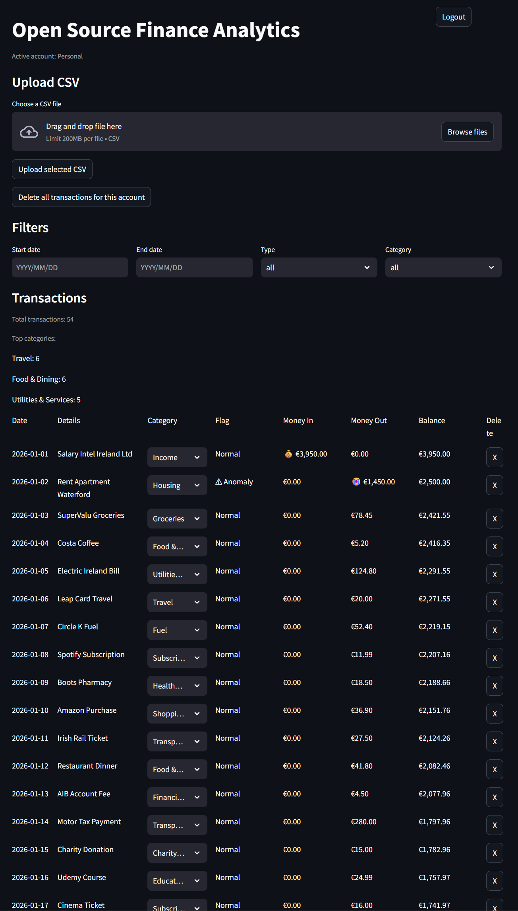
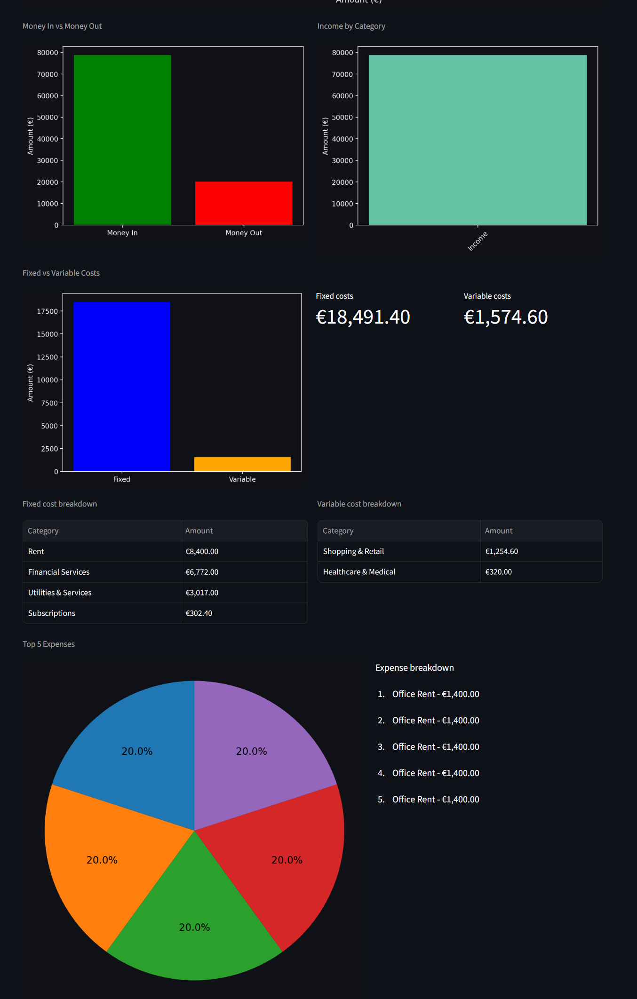
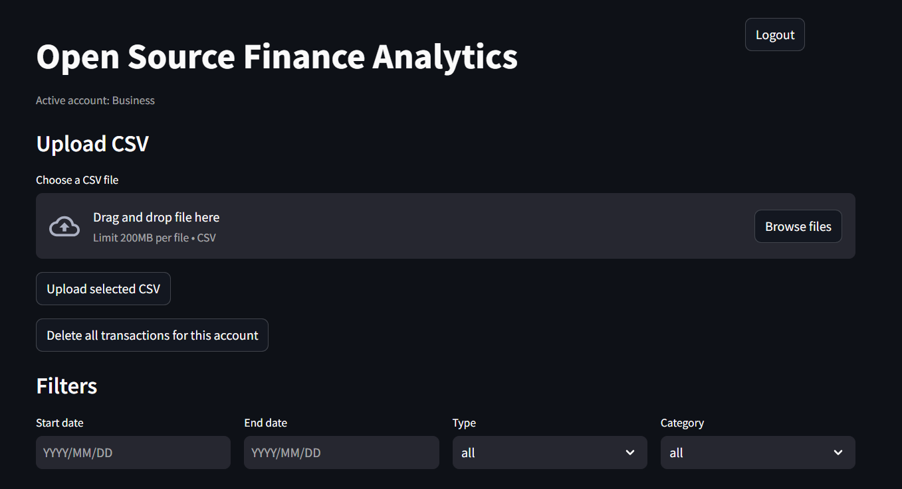
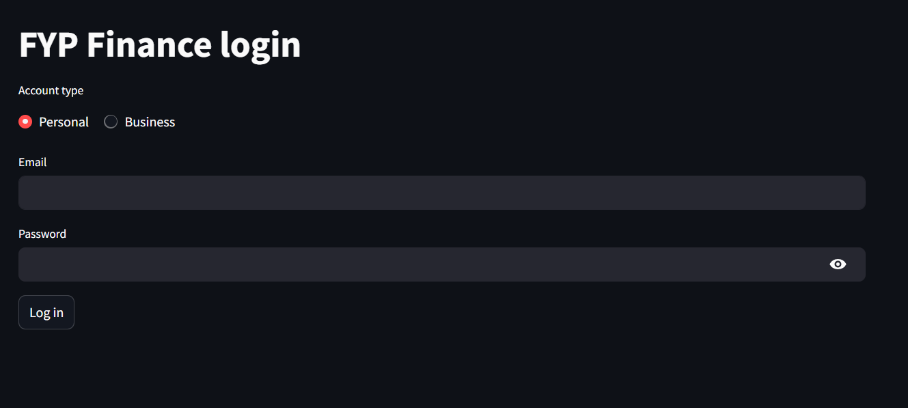

# FYP Finance

An open source financial analytics system using AI to support personal and business budgeting through automated transaction analysis.

## Project Overview

FYP Finance is a full stack financial analytics application that allows users to upload transaction data and generate meaningful financial insights through automated processing.

The system is designed to operate entirely in a local environment, ensuring that sensitive financial data is never transmitted to external services.

The application supports both personal and business datasets.

The system consists of:

1. Streamlit frontend dashboard  
2. FastAPI backend REST API  
3. PostgreSQL database  
4. Hybrid transaction categorisation pipeline using rule based logic and a zero shot AI model  

## Screenshots

## Dashboard Overview


## Analytics and Charts


## CSV Upload Interface


## Login Screen


## Core Features

1. CSV upload and transaction parsing  
2. Automatic transaction categorisation  
3. Hybrid classification using rule based logic with AI fallback  
4. Anomaly detection for unusually large expenses  
5. Support for personal and business accounts  
6. Interactive dashboard with charts and filters  
7. Manual category override and correction  
8. Per user transaction separation  

## Technology Stack

### Frontend
Streamlit  

### Backend
FastAPI  
Uvicorn  

### Database
PostgreSQL  
SQLAlchemy  

### Data Processing
pandas  

### AI and NLP
transformers  
PyTorch  
facebook/bart-large-mnli  

### Other Libraries
python-dotenv  
requests  
psycopg2-binary  
matplotlib  

## Prerequisites

Before running the project, ensure the following are installed:

1. Python 3.11 or newer  
2. PostgreSQL  
3. Git  
4. Terminal such as Windows Terminal or PowerShell  
5. VS Code recommended  

## Setup Instructions

### 1. Clone the repository

```bash
git clone <your-repo-url>
cd fyp-finance
```

### 2. Create and activate a virtual environment

On Windows:

```bash
python -m venv .venv
.venv\Scripts\activate
```

On macOS or Linux:

```bash
python3 -m venv .venv
source .venv/bin/activate
```

### 3. Install dependencies

If a requirements file exists:

```bash
pip install -r requirements.txt
```

Otherwise:

```bash
pip install fastapi uvicorn sqlalchemy psycopg2-binary pandas python-dotenv streamlit transformers torch matplotlib requests
```

### 4. Install and configure PostgreSQL

Ensure PostgreSQL is running.

Create the database and user:

```sql
CREATE DATABASE fyp_finance;
CREATE USER fyp_user WITH PASSWORD 'your_password_here';
GRANT ALL PRIVILEGES ON DATABASE fyp_finance TO fyp_user;
```

### 5. Create the .env file

In the project root, create a `.env` file:

```
DB_HOST=localhost
DB_PORT=5432
DB_NAME=fyp_finance
DB_USER=fyp_user
DB_PASSWORD=your_password_here

API_HOST=127.0.0.1
API_PORT=8000
```

### 6. Create database tables

If your project includes an initialisation script, run it.

Otherwise:

```python
from backend.db import engine, Base
from backend import models

Base.metadata.create_all(bind=engine)
```

### 7. Create login users

```bash
python -m backend.create_user demo@example.com demo123
python -m backend.create_user business@example.com demo123
```

### 8. Start the FastAPI backend

```bash
uvicorn backend.main:app --reload
```

Backend will be available at:

http://127.0.0.1:8000

### 9. Start the Streamlit frontend

In a second terminal:

```bash
streamlit run app/streamlit_app.py
```

Frontend will be available at:

http://localhost:8501

## Using the Application

1. Log into the system  
2. Upload a CSV file  
3. Allow backend processing  
4. View transaction table and analytics dashboard  

## Expected CSV Format

Minimum required fields:

1. date  
2. description  

One of the following must also be present:

- amount  
OR  
- money_in and money_out  

Optional fields:

1. merchant  
2. balance  
3. currency  
4. transaction_id  

The system supports both standardised CSV files with a single amount column and bank export formats where incoming and outgoing values are stored separately.  

During upload, the system automatically normalises these formats into a single internal amount value before categorisation, anomaly scoring, and storage.

## Data Processing Pipeline

The upload pipeline performs:

1. date parsing  
2. transaction value normalisation (amount OR money_in and money_out)  
3. duplicate detection  
4. categorisation  
5. anomaly scoring  
6. insertion into the database  

Malformed files are safely rejected.

Missing values are handled using fallback logic.

## How Categorisation Works

The system uses a hybrid pipeline:

Step 1  
Positive amounts are classified as Income  

Step 2  
High confidence rule based matching handles known patterns  

Step 3  
If no rule matches, the system uses the Hugging Face facebook/bart-large-mnli zero shot classification model  

Step 4  
The predicted category is validated against the allowed category list  

Step 5  
Fallback category is applied if required  

## How Anomaly Detection Works

Anomaly detection is rule based and evaluates only outgoing transactions.

The system:

1. extracts expense transactions  
2. calculates average expense  
3. computes anomaly score per transaction  
4. flags transactions greater than four times the average and above one hundred  

Anomaly results are stored during upload and reused during retrieval.

## Project Structure

```
fyp-finance/
app/
    streamlit_app.py
backend/
    main.py
    db.py
    models.py
    schemas.py
    categoriser.py
    anomaly.py
    auth.py
    create_user.py
.env
requirements.txt
README.md
```

## Key Files

app/streamlit_app.py  
Frontend dashboard  

backend/main.py  
Main FastAPI application  

backend/categoriser.py  
Hybrid categorisation logic  

backend/anomaly.py  
Anomaly detection logic  

backend/models.py  
Database models  

backend/db.py  
Database connection  

## First Run Checklist

1. PostgreSQL is running  
2. .env file is configured  
3. dependencies are installed  
4. database tables exist  
5. login users are created  
6. backend starts without errors  
7. frontend loads correctly  
8. CSV uploads successfully  
9. transactions appear in the dashboard  
10. categories and anomalies display correctly  

## Common Issues and Fixes

Problem: database connection error  
Fix: check DB_HOST, DB_PORT, DB_NAME, DB_USER, DB_PASSWORD  

Problem: login fails  
Fix: ensure user exists and password is correct  

Problem: frontend cannot load data  
Fix: check API_HOST and API_PORT  

Problem: model classification slow on first run  
Fix: expected behaviour, model is cached after first load  

Problem: CSV upload fails  
Fix: ensure required fields exist  

Problem: duplicate transactions  
Fix: ensure consistent transaction_id or matching fields  

## Notes for Assessors

This project is designed to run locally in a controlled environment.

No external financial APIs are used.

All financial data remains within the local system.

The AI categorisation model is used as a fallback only after rule based matching fails.

## Suggested Demo Accounts

Personal  
demo@example.com  

Business  
business@example.com  

Password  
demo123  

## Final Summary

To run the system:

1. install Python and PostgreSQL  
2. clone the repository  
3. create virtual environment  
4. install dependencies  
5. configure .env  
6. create database  
7. initialise tables  
8. create users  
9. start backend  
10. start frontend  
11. upload CSV data  

Open Analytics.

A privacy focused financial analytics platform combining rule based logic with AI to deliver accurate and interpretable financial insights locally.